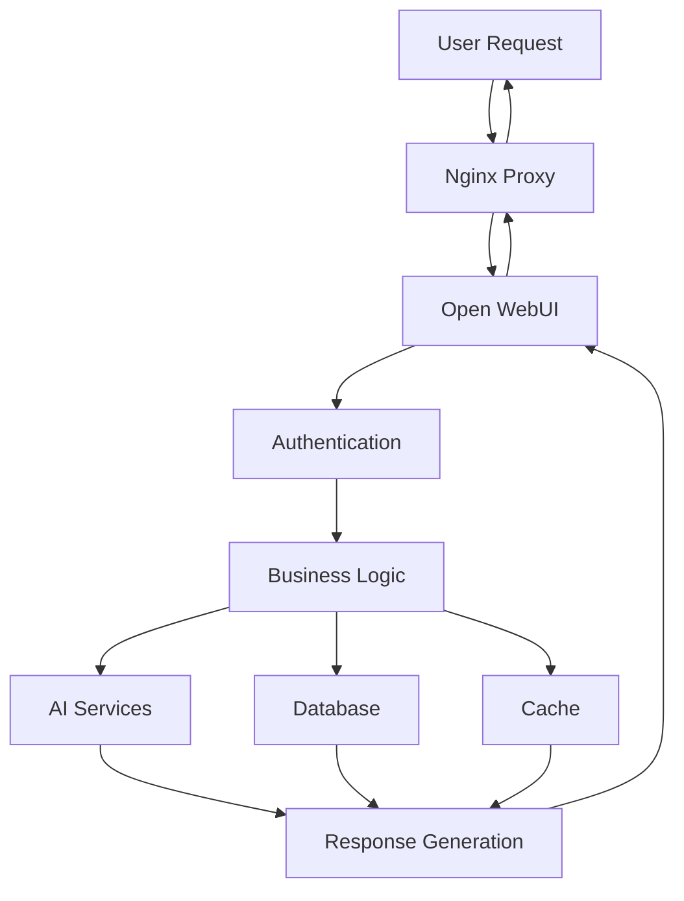
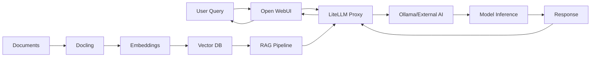
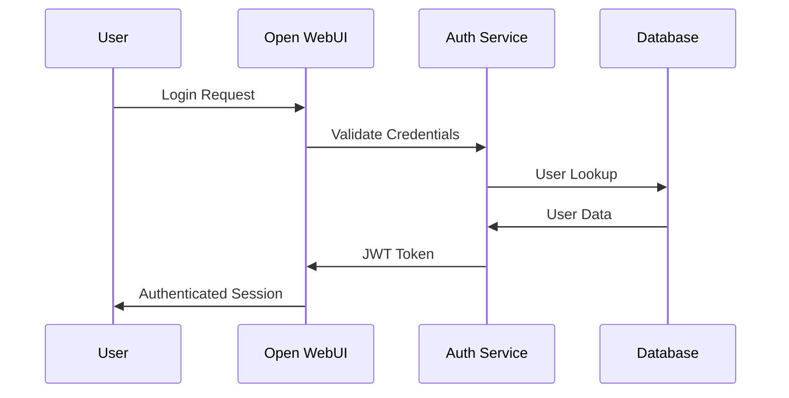

# 🏗️ Architecture Overview

System architecture and design documentation for Open WebUI Hub.

## 📖 Architecture Documentation

| Document | Description | Priority |
|----------|-------------|----------|
| [**Service Architecture**](service-diagram.md) | System overview and service connections | High |
| [Data Flow](data-flow.md) | Data processing and storage flows | Medium |
| [Decision Records](decision-records/README.md) | Architectural decisions (ADRs) | Medium |

## 🎯 Architecture by Perspective

### **System Overview**
1. [Service Architecture](service-diagram.md) - Complete system diagram
2. [Data Flow](data-flow.md) - Information flow between components
3. [Technology Stack](#technology-stack) - Technologies and frameworks used

### **Design Decisions**
1. [Decision Records](decision-records/README.md) - Why we made specific choices
2. [Trade-offs and Considerations](#trade-offs) - Architecture considerations
3. [Future Evolution](#roadmap) - Planned architectural improvements

## 🏗️ System Architecture

Open WebUI Hub follows a **microservices architecture** with containerized services orchestrated by Docker Compose.

### Core Principles
- **Modularity**: Each service has a single responsibility
- **Scalability**: Services can be scaled independently
- **Resilience**: Failure isolation between services
- **Observability**: Comprehensive monitoring and logging

### Service Categories

#### 🤖 AI Services
- **Ollama**: Local LLM inference server
- **LiteLLM**: Unified API proxy for multiple AI providers
- **Docling**: Document processing and parsing
- **EdgeTTS**: Text-to-speech conversion

#### 🗄️ Data Services
- **PostgreSQL**: Primary database with pgvector extension
- **Redis**: Cache, sessions, and message broker
- **Vector Search**: Embedding storage and similarity search

#### 🌐 Web Services
- **Open WebUI**: Main user interface
- **Nginx**: Reverse proxy and load balancer
- **SearXNG**: Privacy-focused search engine

#### 🔧 Infrastructure Services
- **Auth**: JWT authentication and authorization
- **Watchtower**: Automated container updates
- **Tika**: Document metadata extraction

## 🔄 Data Flow Architecture

### Request Processing Flow

### AI Processing Pipeline

## 💾 Data Architecture

### Storage Strategy
- **PostgreSQL**: Structured data, user accounts, configurations
- **pgvector**: Vector embeddings for semantic search
- **Redis**: Ephemeral data, sessions, cache
- **File System**: Model storage, logs, temporary files

### Data Consistency
- **ACID Compliance**: PostgreSQL for critical data
- **Eventual Consistency**: Redis for cache and sessions
- **Backup Strategy**: Regular automated backups
- **Recovery Procedures**: Point-in-time recovery capabilities

## 🛡️ Security Architecture

### Authentication Flow

### Security Layers
- **Network Security**: Container isolation, firewall rules
- **Application Security**: JWT tokens, input validation
- **Data Security**: Encryption at rest, secure connections
- **Infrastructure Security**: Regular updates, access controls

## 📈 Scalability Design

### Horizontal Scaling
- **Stateless Services**: Easy to replicate
- **Load Balancing**: Nginx for traffic distribution
- **Database Scaling**: Read replicas, connection pooling
- **Cache Scaling**: Redis clustering support

### Performance Optimization
- **Caching Strategy**: Multi-layer caching approach
- **Connection Pooling**: Efficient database connections
- **Resource Limits**: Container resource constraints
- **Monitoring**: Performance metrics and alerting

## 🔧 Technology Stack

### Core Technologies
| Component | Technology | Version | Purpose |
|-----------|------------|---------|---------|
| **Container Runtime** | Docker | 20.10+ | Containerization |
| **Orchestration** | Docker Compose | 2.0+ | Service orchestration |
| **Database** | PostgreSQL | 15+ | Primary data storage |
| **Vector Database** | pgvector | 0.5+ | Embedding storage |
| **Cache** | Redis | 7+ | Caching and sessions |
| **Web Server** | Nginx | 1.25+ | Reverse proxy |

### AI/ML Stack
| Component | Technology | Purpose |
|-----------|------------|---------|
| **Local LLM** | Ollama | Local model inference |
| **API Proxy** | LiteLLM | Multi-provider AI API |
| **Document Processing** | Docling | PDF and document parsing |
| **Text-to-Speech** | EdgeTTS | Audio generation |
| **Embeddings** | Various | Vector representations |

### Development Stack
| Component | Technology | Purpose |
|-----------|------------|---------|
| **Backend** | Python/Flask | API development |
| **Frontend** | HTML/CSS/JS | Web interface |
| **Monitoring** | Custom Dashboard | System monitoring |
| **Testing** | pytest | Test framework |

## 🎯 Design Patterns

### Architectural Patterns
- **Microservices**: Service decomposition
- **API Gateway**: Unified entry point (Nginx)
- **Database per Service**: Data isolation
- **Event-Driven**: Asynchronous communication

### Integration Patterns
- **Service Discovery**: Docker networking
- **Circuit Breaker**: Failure isolation
- **Retry Pattern**: Resilient service calls
- **Health Checks**: Service monitoring

## 🔮 Future Architecture Evolution

### Short-term Improvements (3-6 months)
- **Service Mesh**: Istio/Linkerd implementation
- **Advanced Monitoring**: Prometheus + Grafana
- **API Versioning**: Backward compatibility
- **Automated Testing**: CI/CD pipeline

### Medium-term Evolution (6-12 months)
- **Kubernetes Migration**: Container orchestration
- **Microservice Splitting**: Further decomposition
- **Event Streaming**: Apache Kafka integration
- **Advanced Security**: Zero-trust architecture

### Long-term Vision (1+ years)
- **Multi-region Deployment**: Geographic distribution
- **Auto-scaling**: Dynamic resource allocation
- **AI/ML Pipeline**: Automated model training
- **Edge Computing**: Local inference optimization

## 📊 Architecture Metrics

### Performance Targets
- **Response Time**: <500ms for 95th percentile
- **Throughput**: 1000+ requests/second
- **Availability**: 99.9% uptime
- **Scalability**: 10x horizontal scaling capability

### Resource Efficiency
- **CPU Utilization**: <80% average
- **Memory Usage**: <85% of allocated
- **Storage Efficiency**: Optimized data layouts
- **Network Bandwidth**: Minimal inter-service communication

## 📚 Related Documentation

- [Service Configuration](../configuration/services/README.md) - Individual service setup
- [Operations Guide](../operations/README.md) - System administration
- [Development Guide](../development/README.md) - Development environment
- [Monitoring Guide](../operations/monitoring.md) - System monitoring

## 🏷️ Tags
#architecture #design #microservices #scalability #performance

---
*Architecture documentation is living and evolves with the system. Regular reviews ensure it stays current.*