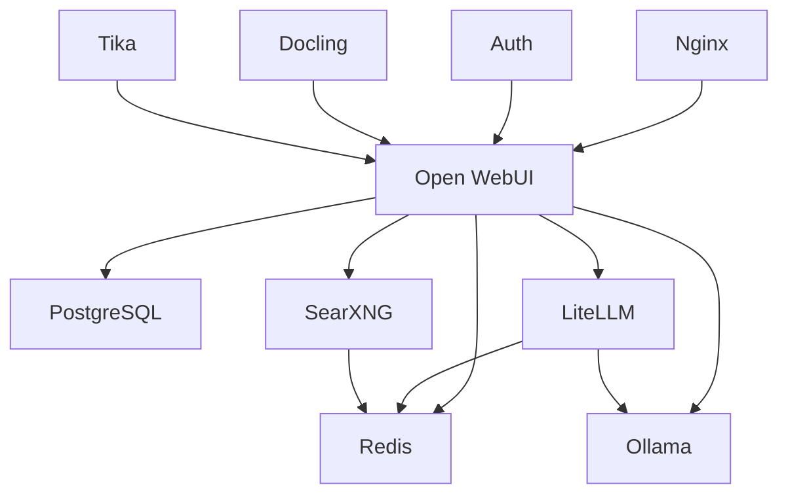

# 🔧 Service Configuration

Individual configuration guides for all Open WebUI Hub services.

## 📖 Service Overview

| Service | Document | Priority | Dependencies |
|---------|----------|----------|--------------|
| [**LiteLLM**](litellm.md) | AI model proxy configuration | High | Ollama, Redis |
| [Ollama](ollama.md) | Local LLM server setup | High | None |
| [PostgreSQL](postgresql.md) | Database configuration | High | None |
| [Redis](redis.md) | Cache and session store | Medium | None |
| [Nginx](nginx.md) | Reverse proxy setup | Medium | All services |
| [SearXNG](searxng.md) | Search engine configuration | Low | Redis |

## 🎯 Configuration by Category

### AI Services
- **LiteLLM**: Unified API proxy for multiple AI providers
- **Ollama**: Local language model inference server
- **Docling**: Document processing and parsing
- **EdgeTTS**: Text-to-speech conversion

### Core Infrastructure  
- **PostgreSQL**: Primary database with vector support
- **Redis**: Cache, sessions, and message broker
- **Nginx**: Reverse proxy and load balancer
- **Watchtower**: Automated container updates

### Supporting Services
- **SearXNG**: Privacy-focused search engine
- **Tika**: Document metadata extraction
- **Auth**: JWT authentication validator

## 🔄 Service Dependencies



## ⚙️ Common Configuration Tasks

### Changing Ports
1. Update `compose.local.yml` port mappings
2. Update service-specific environment files
3. Update nginx configuration if needed
4. Restart affected services

### Adding External APIs
1. Configure service-specific API keys
2. Update connection URLs
3. Test connectivity
4. Update monitoring configurations

### Security Hardening
1. Change default passwords
2. Configure firewall rules
3. Enable SSL/TLS
4. Set up authentication

## 🔍 Quick Configuration Reference

### Environment Files Location
```
env/
├── auth.env          # JWT authentication
├── db.env            # PostgreSQL settings
├── litellm.env       # LiteLLM API keys
├── ollama.env        # Ollama configuration
├── openwebui.env     # Main application
├── redis.env         # Redis cache settings
└── ...
```

### Configuration Files Location
```
conf/
├── litellm/
│   └── litellm_config.yaml
├── nginx/
│   ├── nginx.conf
│   └── conf.d/default.conf
├── searxng/
│   ├── settings.yml
│   └── uwsgi.ini
└── ...
```

## 🚨 Important Notes

- **Backup First**: Always backup configurations before changes
- **Test Changes**: Use development environment for testing
- **Service Restart**: Most changes require service restart
- **Dependencies**: Check service dependencies before modifications
- **Security**: Review security implications of configuration changes

## 📚 Related Documentation

- [Environment Variables](../environment-variables.md) - All configuration options
- [Security Settings](../security.md) - Security configuration
- [Getting Started](../../getting-started/README.md) - Initial setup
- [Operations Guide](../../operations/README.md) - Service management